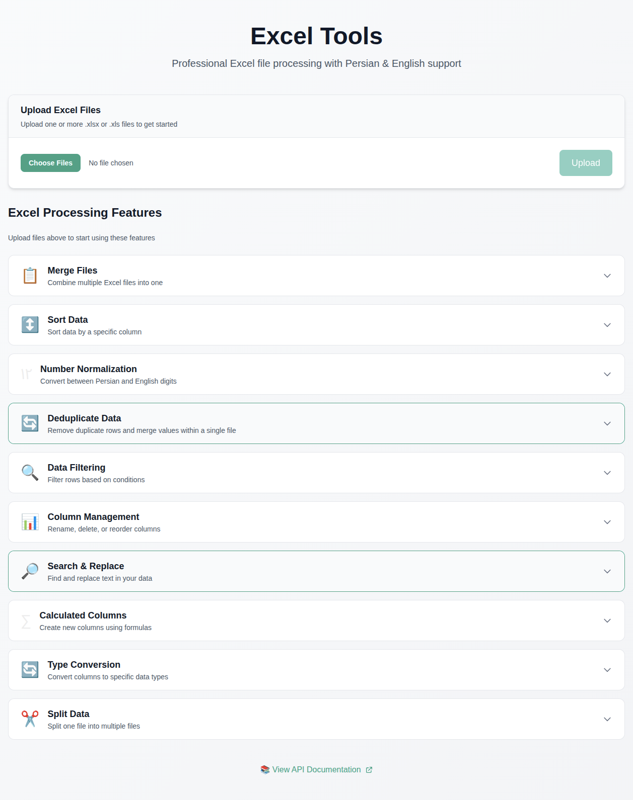

# Excel Tools

A modern, modular web application for processing Excel files with **Persian and English** support, built with **Feature-Sliced Design (FSD)** architecture.



## 🎨 Features

- ✅ **File Upload & Preview** - Upload Excel files and preview data
- ✅ **File Merge** - Combine multiple Excel files into one
- ✅ **Deduplicate & Merge** - Remove duplicates and sum numeric columns
- ✅ **Sort Data** - Sort by any column (ascending/descending)
- ✅ **Number Normalization** - Convert Persian digits (۰-۹) ↔ English (0-9)
- ✅ **Data Filtering** - Filter rows with conditional logic
- ✅ **Column Management** - Rename, delete, and reorder columns
- ✅ **Search & Replace** - Find and replace text in columns
- ✅ **Type Conversion** - Cast columns to String, Integer, Float, Boolean, DateTime
- ✅ **Calculated Columns** - Create new columns from formulas
- ✅ **Split Data** - Split files by unique values or row count

## 🏗️ Architecture

Built following **Feature-Sliced Design** principles:
- **Backend**: FastAPI with stateless file_id workflow
- **Frontend**: Next.js 14 with TypeScript and Tailwind CSS
- **Design System**: Custom teal color scheme (#109f86)
- **Containerized**: Docker & Docker Compose for easy deployment

## 🚀 Quick Start

### Local Development

1. **Backend**:
```bash
cd backend
pip install -r requirements.txt
uvicorn app.main:app --reload
```

2. **Frontend**:
```bash
cd frontend
npm install
npm run dev
```

3. Access:
   - Frontend: http://localhost:3000
   - API Docs: http://localhost:8000/docs

### Docker Deployment

#### Local (Development)
```bash
docker-compose up -d
```

#### Production (shamim313.com)
```bash
docker-compose -f docker-compose.shamim.yml up -d
```

## 📁 Project Structure

```
Excel_Tools/
├── backend/
│   ├── app/
│   │   ├── core/           # Configuration & dependencies
│   │   ├── shared/         # FileService & common models
│   │   └── features/       # Feature modules (FSD)
│   │       ├── file_upload/
│   │       ├── file_preview/
│   │       ├── deduplicate_merge/
│   │       └── ... (11 total features)
│   ├── Dockerfile
│   └── requirements.txt
├── frontend/
│   ├── app/                # Next.js app directory
│   ├── components/         # UI components
│   ├── lib/                # API client & utilities
│   ├── types/              # TypeScript types
│   └── Dockerfile
├── docker-compose.yml           # Local deployment
└── docker-compose.shamim.yml    # Production deployment
```

## 🔧 Technology Stack

### Backend
- **Framework**: FastAPI
- **Data Processing**: pandas + openpyxl
- **Validation**: Pydantic
- **Server**: Uvicorn

### Frontend
- **Framework**: Next.js 14
- **Language**: TypeScript
- **Styling**: Tailwind CSS
- **UI**: Custom component library

## 🌐 API Endpoints

All endpoints documented at `/docs` (Swagger UI):

- `POST /api/upload` - Upload file
- `GET /api/preview/{file_id}` - Preview data
- `POST /api/merge` - Merge files
- `POST /api/deduplicate-merge` - Deduplicate & merge
- `POST /api/sort` - Sort data
- `POST /api/normalize-numbers` - Persian/English conversion
- `POST /api/filter` - Filter rows
- `POST /api/columns/*` - Column operations
- `POST /api/search-replace` - Search & replace
- `POST /api/convert-types` - Type conversion
- `POST /api/calculated-column` - Create calculated column
- `POST /api/split` - Split data

## 📝 Workflow

The application follows a **stateless file_id workflow**:

1. Upload file → receive `file_id`
2. Perform operation with `file_id` → receive new `file_id`
3. Repeat as needed
4. Download final result using final `file_id`

## 🎨 Design

- **Primary Color**: `#109f86` (Teal)
- **Hover State**: `#0d8a73`
- **Light Accent**: `#14b8a6`

## 🌍 Language Support

Full support for:
- ✅ Persian text in data and column headers
- ✅ Persian digits (۰-۹) ↔ English digits (0-9) conversion
- ✅ RTL/LTR text handling

## 🐳 Docker Configuration

### Environment Variables

Create `.env` file:
```env
# Application
APP_NAME=Excel Tools API
DEBUG=false

# CORS
CORS_ORIGINS=http://localhost:3000 # For local development and Production

# File Storage
MAX_FILE_SIZE_MB=500
FILE_RETENTION_HOURS=1
```

### Nginx Proxy Manager

The production Docker Compose file (`docker-compose.shamim.yml`) is configured to work with **Nginx Proxy Manager**. No additional nginx container is required.

## 📄 License

MIT License - feel free to Fork and Contributing for your projects!

## 👨‍💻 Author

Built with ❤️ by USFAkbari
